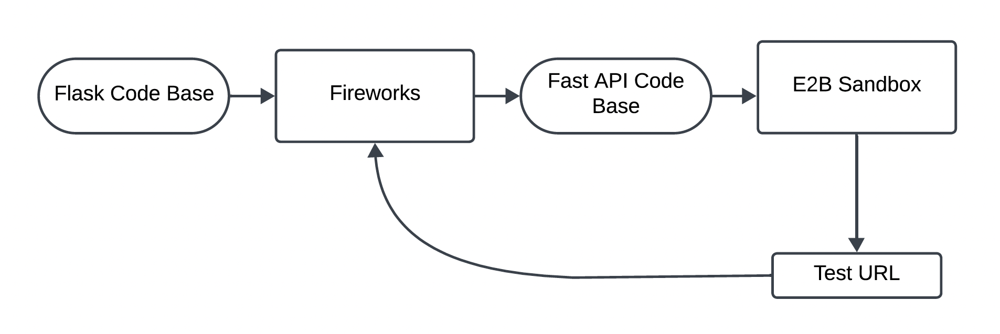

# Flask to the Future - Convert Flask apps to FastAPI
## e2b-hackathon-2024

This repository contains an agent workflow for converting a **Flask codebase** to a **FastAPI codebase** using **Fireworks LLM**, deploying it to an **E2B sandbox**, and testing the deployment via a test URL.

## Workflow Overview

The diagram below explains the flow from a Flask codebase to deploying and testing a FastAPI application:

### Steps in the Workflow:

1. **Flask Code Base**:
   - Start with a Flask-based application. This serves as the initial codebase.

2. **Fireworks**:
   - Use the **Fireworks** framework to convert the Flask application to a FastAPI application. This conversion ensures that the functionality remains intact but adapts the code to FastAPI’s framework and structure.

3. **FastAPI Code Base**:
   - After conversion, you now have a FastAPI codebase ready for deployment. This new codebase is structured according to FastAPI standards and optimized for the framework’s asynchronous capabilities.

4. **E2B Sandbox**:
   - Deploy the FastAPI code to the **E2B Sandbox**, a testing environment that allows you to run and interact with your FastAPI app without affecting production.

5. **Test URL**:
   - Once deployed, the E2B Sandbox provides a **Test URL** that can be used to verify that the application is running correctly. You can send test requests to this URL to check the application's functionality.

